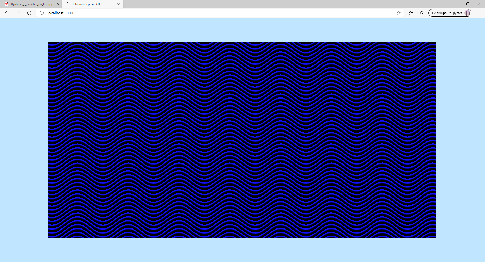
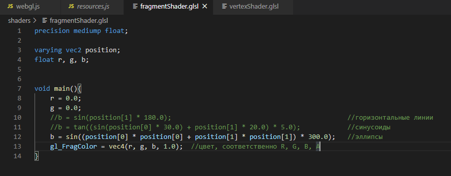

# WebGL_1Lab
Первая лаба по opengl

Первый случай: горизонтальные линии

Второй случай: синусоиды

Третий случай: эллипсы

Для изменения вида отображаемых линий нужно раскомментировать нужный тип и закомментировать остальные типы

Шаблон кода взят с репозитория
https://github.com/QuandoPro/webgl_lesson_3
